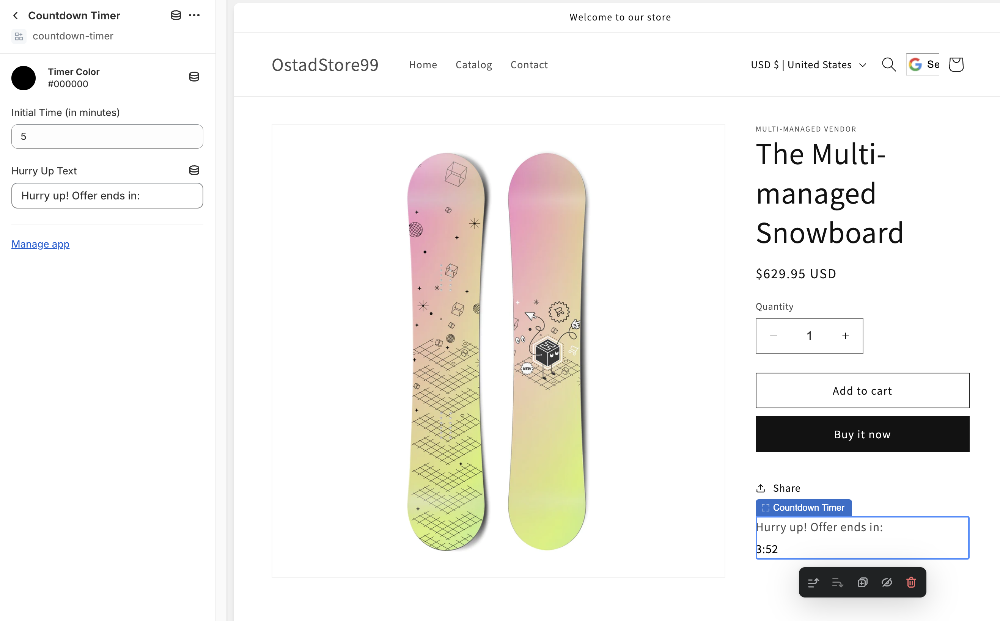

## About
This is a Shopy Theme App Extension project which displays a simple countdown timer on the Product page of a shopify store.

## Executing the App
To Run this Project, Please update the configuration in the shopify.app.toml based on your shop configuration.
Then inside the project directory, run:
```shell
npm run dev
```
## Installing the Theme App Extension on the store
Once run successfully, a preview URL will be provided which will take the user to the store admin panel.
If the app is not installed, it will ask the necessary permission to the store owner.
Once the app is installed, the user will be navigated to the store admin panel on the left.

On the left, under "Sales channels" section click "Online Store". From the Online Store menu click "Themes".
In the Themes page, click "Customize" to customize the theme.
In the "Header" section, click "Add block". In the pop-up menu, Under the "App Blocks" section, select this exention with name "Countdown Timer".
Save the change.

## Troubleshooting
This app is tested on MacOS. So, if you experice any issue on Windows machine, please try on MacOS. 
If you still experince issues, please feel free to shoot me an email.
My email: iqbal.morshed99@gmail.com

Thanks for checking my app!